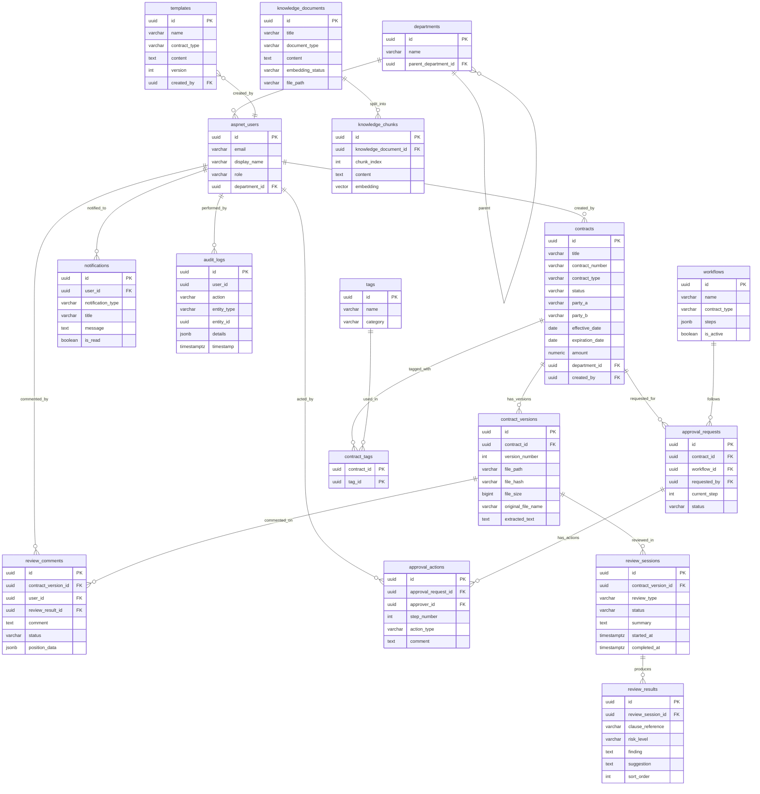

# AI契約書管理・レビューシステム データベース設計書

## 文書管理情報

| 項目 | 内容 |
|------|------|
| 文書名 | AI契約書管理・レビューシステム データベース設計書 |
| プロジェクト名 | BlazorTailwindApp - Contract AI |
| バージョン | 0.1（初版ドラフト） |
| 作成日 | 2026-03-07 |
| ステータス | ドラフト |
| 対応要件定義書 | `docs/requirements-definition.md` v0.1 |

---

## 第1章 設計方針

### 1.1 全体方針

| 項目 | 方針 |
|------|------|
| RDBMS | PostgreSQL |
| ORM | Entity Framework Core (.NET 10) |
| 主キー | UUID（PostgreSQL: `uuid` / EF Core: `Guid`） |
| 命名規則 | テーブル名・カラム名はスネークケース（`UseSnakeCaseNamingConvention()`） |
| ソフトデリート | `is_deleted boolean NOT NULL DEFAULT false` + EF Core Global Query Filter |
| タイムスタンプ | `timestamptz`（タイムゾーン付き） |
| 文字列 | `varchar(n)` で上限明示、長文は `text` |
| 金額 | `numeric(18,2)` |
| ENUM管理 | PostgreSQL ENUM型は使わず `varchar` + アプリ側Enumで管理（EF Core互換性） |
| ベクトル検索 | pgvector拡張 `vector(1536)`（OpenAI text-embedding-3-small互換） |
| 認証基盤 | ASP.NET Identity（`IdentityUser<Guid>` を拡張） |

### 1.2 BaseEntity

全テーブル共通の基底カラム（例外: `audit_logs`, `contract_tags`）。

| カラム名 | 型 | NULL | デフォルト | 説明 |
|----------|-----|:----:|-----------|------|
| created_at | timestamptz | NO | `now()` | 作成日時 |
| updated_at | timestamptz | NO | `now()` | 更新日時 |
| created_by | uuid | YES | - | 作成者ユーザーID |
| updated_by | uuid | YES | - | 更新者ユーザーID |
| is_deleted | boolean | NO | `false` | ソフトデリートフラグ |

> EF Core側で `SaveChanges` 時に `updated_at` を自動更新する。`created_by` / `updated_by` は認証コンテキストから自動設定する。

### 1.3 ID採番

- 全テーブルの主キーはUUID v7（時系列ソート可能）を推奨
- EF Core側で `Guid.CreateVersion7()` (.NET 9+) を利用
- PostgreSQLの `gen_random_uuid()` はフォールバック用

---

## 第2章 ER図



---

## 第3章 共通定義

### 3.1 ENUM定義

アプリケーション側（C# enum）で管理し、DBには `varchar` として格納する。

#### ContractType（契約種別）

| 値 | 説明 |
|----|------|
| `NDA` | 秘密保持契約 |
| `ServiceAgreement` | 業務委託契約 |
| `SalesAgreement` | 売買契約 |
| `LeaseAgreement` | 賃貸借契約 |
| `EmploymentContract` | 雇用契約 |
| `LicenseAgreement` | ライセンス契約 |
| `PartnershipAgreement` | 業務提携契約 |
| `Other` | その他 |

#### ContractStatus（契約ステータス）

| 値 | 説明 |
|----|------|
| `Draft` | ドラフト |
| `UnderReview` | レビュー中 |
| `PendingApproval` | 承認中 |
| `Approved` | 承認済 |
| `Executed` | 締結済 |
| `Expired` | 満了 |
| `Terminated` | 解約 |

#### ReviewType（レビュー種別）

| 値 | 説明 |
|----|------|
| `RiskAnalysis` | リスク分析 |
| `ClauseAnalysis` | 条項分析 |
| `Summary` | 要約生成 |
| `FullReview` | 総合レビュー |

#### ReviewSessionStatus（レビューセッション状態）

| 値 | 説明 |
|----|------|
| `Pending` | 待機中 |
| `Processing` | 処理中 |
| `Completed` | 完了 |
| `Failed` | 失敗 |

#### RiskLevel（リスクレベル）

| 値 | 説明 |
|----|------|
| `High` | 高リスク |
| `Medium` | 中リスク |
| `Low` | 低リスク |
| `Info` | 情報 |

#### CommentStatus（コメント状態）

| 値 | 説明 |
|----|------|
| `Open` | 未対応 |
| `Acknowledged` | 確認済 |
| `Resolved` | 解決済 |
| `Rejected` | 却下 |

#### ApprovalStatus（承認ステータス）

| 値 | 説明 |
|----|------|
| `Pending` | 承認待ち |
| `Approved` | 承認済 |
| `Rejected` | 却下 |
| `Returned` | 差戻し |
| `Cancelled` | 取消 |

#### ApprovalActionType（承認アクション種別）

| 値 | 説明 |
|----|------|
| `Approve` | 承認 |
| `Reject` | 却下 |
| `Return` | 差戻し |
| `Delegate` | 代理委譲 |

#### NotificationType（通知種別）

| 値 | 説明 |
|----|------|
| `ApprovalRequest` | 承認依頼 |
| `ApprovalResult` | 承認結果 |
| `ReviewCompleted` | レビュー完了 |
| `StatusChanged` | ステータス変更 |
| `ExpirationAlert` | 期限アラート |
| `HighRiskAlert` | 高リスクアラート |
| `SystemNotice` | システム通知 |

#### EmbeddingStatus（Embedding状態）

| 値 | 説明 |
|----|------|
| `Pending` | 未処理 |
| `Processing` | 処理中 |
| `Completed` | 完了 |
| `Failed` | 失敗 |

#### DocumentType（ナレッジ文書種別）

| 値 | 説明 |
|----|------|
| `Contract` | 過去の契約書 |
| `Guideline` | ガイドライン |
| `Regulation` | 社内規程 |
| `Legal` | 法令・判例 |
| `Other` | その他 |

#### TagCategory（タグカテゴリ）

| 値 | 説明 |
|----|------|
| `ContractType` | 契約種別 |
| `Department` | 部門 |
| `Partner` | 取引先 |
| `Custom` | カスタム |

#### UserRole（ユーザーロール）

| 値 | 説明 |
|----|------|
| `Admin` | 管理者 |
| `Manager` | 法務マネージャー |
| `Reviewer` | 法務レビュアー |
| `Requester` | 依頼者 |
| `Viewer` | 閲覧者 |

---

## 第4章 テーブル定義書

### 4.1 aspnet_users（ユーザー）

ASP.NET Identity の `IdentityUser<Guid>` を拡張した `ApplicationUser`。Identity標準カラムに加え、以下の拡張カラムを持つ。

> Identity標準カラム（`id`, `user_name`, `normalized_user_name`, `email`, `normalized_email`, `email_confirmed`, `password_hash`, `security_stamp`, `concurrency_stamp`, `phone_number`, `phone_number_confirmed`, `two_factor_enabled`, `lockout_end`, `lockout_enabled`, `access_failed_count`）は省略。

**拡張カラム:**

| カラム名 | 型 | NULL | デフォルト | 説明 |
|----------|-----|:----:|-----------|------|
| display_name | varchar(100) | NO | - | 表示名 |
| role | varchar(50) | NO | `'Viewer'` | ユーザーロール（UserRole enum） |
| department_id | uuid | YES | - | 所属部門ID → departments.id |
| is_active | boolean | NO | `true` | アカウント有効フラグ |
| last_login_at | timestamptz | YES | - | 最終ログイン日時 |
| created_at | timestamptz | NO | `now()` | 作成日時 |
| updated_at | timestamptz | NO | `now()` | 更新日時 |

> `is_deleted` は使用せず、`is_active` でアカウントの有効/無効を管理する。ASP.NET Identityの `LockoutEnabled` / `LockoutEnd` と併用。

### 4.2 departments（部門）

| カラム名 | 型 | NULL | デフォルト | 説明 |
|----------|-----|:----:|-----------|------|
| id | uuid | NO | - | PK |
| name | varchar(100) | NO | - | 部門名 |
| code | varchar(20) | YES | - | 部門コード |
| parent_department_id | uuid | YES | - | 親部門ID → departments.id（自己参照） |
| sort_order | int | NO | `0` | 表示順 |
| _BaseEntity_ | | | | created_at, updated_at, created_by, updated_by, is_deleted |

### 4.3 contracts（契約書）

| カラム名 | 型 | NULL | デフォルト | 説明 |
|----------|-----|:----:|-----------|------|
| id | uuid | NO | - | PK |
| title | varchar(200) | NO | - | 契約書タイトル |
| contract_number | varchar(50) | YES | - | 契約番号（部分ユニーク: `WHERE is_deleted = false`） |
| contract_type | varchar(50) | NO | - | 契約種別（ContractType enum） |
| status | varchar(50) | NO | `'Draft'` | ステータス（ContractStatus enum） |
| description | text | YES | - | 概要・備考 |
| party_a | varchar(200) | NO | - | 甲（自社側当事者名） |
| party_b | varchar(200) | YES | - | 乙（相手方当事者名） |
| effective_date | date | YES | - | 契約開始日 |
| expiration_date | date | YES | - | 契約終了日 |
| auto_renewal | boolean | NO | `false` | 自動更新有無 |
| amount | numeric(18,2) | YES | - | 契約金額 |
| currency | varchar(3) | NO | `'JPY'` | 通貨コード（ISO 4217） |
| department_id | uuid | YES | - | 管轄部門 → departments.id |
| assigned_reviewer_id | uuid | YES | - | 担当レビュアー → aspnet_users.id |
| _BaseEntity_ | | | | created_at, updated_at, created_by, updated_by, is_deleted |

### 4.4 contract_versions（契約書バージョン）

| カラム名 | 型 | NULL | デフォルト | 説明 |
|----------|-----|:----:|-----------|------|
| id | uuid | NO | - | PK |
| contract_id | uuid | NO | - | 契約書ID → contracts.id |
| version_number | int | NO | - | バージョン番号（1始まり） |
| file_path | varchar(500) | NO | - | ファイル保存パス |
| file_name | varchar(255) | NO | - | 元ファイル名 |
| file_size | bigint | NO | - | ファイルサイズ（bytes） |
| content_type | varchar(100) | NO | - | MIMEタイプ |
| file_hash | varchar(64) | NO | - | SHA-256ハッシュ |
| extracted_text | text | YES | - | 抽出テキスト（OCR/PDF解析結果） |
| change_summary | text | YES | - | 変更概要 |
| _BaseEntity_ | | | | created_at, updated_at, created_by, updated_by, is_deleted |

### 4.5 review_sessions（AIレビューセッション）

| カラム名 | 型 | NULL | デフォルト | 説明 |
|----------|-----|:----:|-----------|------|
| id | uuid | NO | - | PK |
| contract_version_id | uuid | NO | - | 対象バージョン → contract_versions.id |
| review_type | varchar(50) | NO | - | レビュー種別（ReviewType enum） |
| status | varchar(50) | NO | `'Pending'` | 状態（ReviewSessionStatus enum） |
| summary | text | YES | - | レビュー要約（AI生成） |
| overall_risk_score | int | YES | - | 総合リスクスコア（0-100） |
| model_name | varchar(100) | YES | - | 使用AIモデル名 |
| started_at | timestamptz | YES | - | 処理開始日時 |
| completed_at | timestamptz | YES | - | 処理完了日時 |
| error_message | text | YES | - | エラーメッセージ（失敗時） |
| requested_by | uuid | YES | - | レビュー依頼者 → aspnet_users.id |
| _BaseEntity_ | | | | created_at, updated_at, created_by, updated_by, is_deleted |

### 4.6 review_results（レビュー結果）

| カラム名 | 型 | NULL | デフォルト | 説明 |
|----------|-----|:----:|-----------|------|
| id | uuid | NO | - | PK |
| review_session_id | uuid | NO | - | セッションID → review_sessions.id |
| clause_reference | varchar(200) | YES | - | 該当条項の参照（例: "第5条第2項"） |
| risk_level | varchar(20) | NO | - | リスクレベル（RiskLevel enum） |
| category | varchar(100) | YES | - | リスクカテゴリ（例: "損害賠償", "解除条項"） |
| finding | text | NO | - | 検出事項 |
| suggestion | text | YES | - | 修正提案 |
| original_text | text | YES | - | 元の条文テキスト |
| sort_order | int | NO | `0` | 表示順 |
| _BaseEntity_ | | | | created_at, updated_at, created_by, updated_by, is_deleted |

### 4.7 review_comments（人間レビューコメント）

| カラム名 | 型 | NULL | デフォルト | 説明 |
|----------|-----|:----:|-----------|------|
| id | uuid | NO | - | PK |
| contract_version_id | uuid | NO | - | 対象バージョン → contract_versions.id |
| user_id | uuid | NO | - | コメント投稿者 → aspnet_users.id |
| review_result_id | uuid | YES | - | 紐付くAIレビュー結果 → review_results.id |
| comment | text | NO | - | コメント本文 |
| status | varchar(50) | NO | `'Open'` | コメント状態（CommentStatus enum） |
| position_data | jsonb | YES | - | ハイライト位置情報（ページ、座標等） |
| _BaseEntity_ | | | | created_at, updated_at, created_by, updated_by, is_deleted |

> `position_data` のJSONスキーマ例:
> ```json
> {
>   "page": 3,
>   "startOffset": 120,
>   "endOffset": 250,
>   "highlightText": "甲は乙に対し..."
> }
> ```

### 4.8 templates（テンプレート）

| カラム名 | 型 | NULL | デフォルト | 説明 |
|----------|-----|:----:|-----------|------|
| id | uuid | NO | - | PK |
| name | varchar(200) | NO | - | テンプレート名 |
| description | text | YES | - | テンプレート説明 |
| contract_type | varchar(50) | NO | - | 契約種別（ContractType enum） |
| content | text | NO | - | テンプレート本文（プレースホルダー含む） |
| placeholders | jsonb | YES | - | プレースホルダー定義 |
| version | int | NO | `1` | テンプレートバージョン |
| is_active | boolean | NO | `true` | 有効フラグ |
| _BaseEntity_ | | | | created_at, updated_at, created_by, updated_by, is_deleted |

> `placeholders` のJSONスキーマ例:
> ```json
> [
>   { "key": "{{party_b_name}}", "label": "相手方名", "type": "text", "required": true },
>   { "key": "{{amount}}", "label": "契約金額", "type": "number", "required": false }
> ]
> ```

### 4.9 workflows（ワークフロー定義）

| カラム名 | 型 | NULL | デフォルト | 説明 |
|----------|-----|:----:|-----------|------|
| id | uuid | NO | - | PK |
| name | varchar(200) | NO | - | ワークフロー名 |
| description | text | YES | - | 説明 |
| contract_type | varchar(50) | YES | - | 対象契約種別（NULL=全種別） |
| min_amount | numeric(18,2) | YES | - | 適用最低金額 |
| max_amount | numeric(18,2) | YES | - | 適用最高金額 |
| steps | jsonb | NO | - | 承認ステップ定義 |
| is_active | boolean | NO | `true` | 有効フラグ |
| _BaseEntity_ | | | | created_at, updated_at, created_by, updated_by, is_deleted |

> `steps` のJSONスキーマ例:
> ```json
> [
>   { "stepNumber": 1, "name": "法務レビュー", "approverRole": "Reviewer", "approverUserId": null },
>   { "stepNumber": 2, "name": "マネージャー承認", "approverRole": "Manager", "approverUserId": null },
>   { "stepNumber": 3, "name": "部長承認", "approverRole": null, "approverUserId": "uuid-of-specific-user" }
> ]
> ```

### 4.10 approval_requests（承認依頼）

| カラム名 | 型 | NULL | デフォルト | 説明 |
|----------|-----|:----:|-----------|------|
| id | uuid | NO | - | PK |
| contract_id | uuid | NO | - | 対象契約書 → contracts.id |
| workflow_id | uuid | NO | - | ワークフロー定義 → workflows.id |
| requested_by | uuid | NO | - | 依頼者 → aspnet_users.id |
| current_step | int | NO | `1` | 現在のステップ番号 |
| status | varchar(50) | NO | `'Pending'` | 承認状態（ApprovalStatus enum） |
| due_date | timestamptz | YES | - | 承認期限 |
| completed_at | timestamptz | YES | - | 完了日時 |
| _BaseEntity_ | | | | created_at, updated_at, created_by, updated_by, is_deleted |

### 4.11 approval_actions（承認アクション）

| カラム名 | 型 | NULL | デフォルト | 説明 |
|----------|-----|:----:|-----------|------|
| id | uuid | NO | - | PK |
| approval_request_id | uuid | NO | - | 承認依頼 → approval_requests.id |
| approver_id | uuid | NO | - | 承認者 → aspnet_users.id |
| step_number | int | NO | - | ステップ番号 |
| action_type | varchar(50) | NO | - | アクション種別（ApprovalActionType enum） |
| comment | text | YES | - | コメント |
| delegated_to | uuid | YES | - | 代理委譲先 → aspnet_users.id |
| acted_at | timestamptz | NO | `now()` | アクション日時 |
| _BaseEntity_ | | | | created_at, updated_at, created_by, updated_by, is_deleted |

### 4.12 knowledge_documents（ナレッジ文書）

| カラム名 | 型 | NULL | デフォルト | 説明 |
|----------|-----|:----:|-----------|------|
| id | uuid | NO | - | PK |
| title | varchar(200) | NO | - | 文書タイトル |
| document_type | varchar(50) | NO | - | 文書種別（DocumentType enum） |
| description | text | YES | - | 説明 |
| content | text | YES | - | 文書本文 |
| file_path | varchar(500) | YES | - | 元ファイルパス |
| file_name | varchar(255) | YES | - | 元ファイル名 |
| embedding_status | varchar(50) | NO | `'Pending'` | Embedding処理状態（EmbeddingStatus enum） |
| chunk_count | int | NO | `0` | チャンク数 |
| _BaseEntity_ | | | | created_at, updated_at, created_by, updated_by, is_deleted |

### 4.13 knowledge_chunks（チャンク）

| カラム名 | 型 | NULL | デフォルト | 説明 |
|----------|-----|:----:|-----------|------|
| id | uuid | NO | - | PK |
| knowledge_document_id | uuid | NO | - | 親文書 → knowledge_documents.id |
| chunk_index | int | NO | - | チャンク番号（0始まり） |
| content | text | NO | - | チャンクテキスト |
| token_count | int | YES | - | トークン数 |
| embedding | vector(1536) | YES | - | Embeddingベクトル（pgvector） |
| metadata | jsonb | YES | - | メタデータ（ページ番号、セクション情報等） |
| _BaseEntity_ | | | | created_at, updated_at, created_by, updated_by, is_deleted |

### 4.14 notifications（通知）

| カラム名 | 型 | NULL | デフォルト | 説明 |
|----------|-----|:----:|-----------|------|
| id | uuid | NO | - | PK |
| user_id | uuid | NO | - | 通知先ユーザー → aspnet_users.id |
| notification_type | varchar(50) | NO | - | 通知種別（NotificationType enum） |
| title | varchar(200) | NO | - | 通知タイトル |
| message | text | NO | - | 通知本文 |
| is_read | boolean | NO | `false` | 既読フラグ |
| read_at | timestamptz | YES | - | 既読日時 |
| link_url | varchar(500) | YES | - | 遷移先URL |
| related_entity_type | varchar(50) | YES | - | 関連エンティティ種別 |
| related_entity_id | uuid | YES | - | 関連エンティティID |
| _BaseEntity_ | | | | created_at, updated_at, created_by, updated_by, is_deleted |

### 4.15 audit_logs（監査ログ）

BaseEntity **非継承**。監査ログ自体は更新・削除しない（追記のみ）。

| カラム名 | 型 | NULL | デフォルト | 説明 |
|----------|-----|:----:|-----------|------|
| id | uuid | NO | - | PK |
| user_id | uuid | YES | - | 操作者ユーザーID（システム操作時はNULL） |
| user_name | varchar(100) | YES | - | 操作者名（非正規化、ユーザー削除後も参照可能） |
| action | varchar(100) | NO | - | 操作種別（例: "Create", "Update", "Delete", "Login", "Download"） |
| entity_type | varchar(100) | YES | - | 対象エンティティ種別（例: "Contract", "ReviewSession"） |
| entity_id | uuid | YES | - | 対象エンティティID |
| details | jsonb | YES | - | 操作詳細（変更前後の値等） |
| ip_address | varchar(45) | YES | - | 操作元IPアドレス |
| user_agent | varchar(500) | YES | - | ユーザーエージェント |
| timestamp | timestamptz | NO | `now()` | 操作日時 |

### 4.16 tags（タグ）

| カラム名 | 型 | NULL | デフォルト | 説明 |
|----------|-----|:----:|-----------|------|
| id | uuid | NO | - | PK |
| name | varchar(100) | NO | - | タグ名 |
| category | varchar(50) | NO | - | タグカテゴリ（TagCategory enum） |
| color | varchar(7) | YES | - | 表示色（HEXカラー、例: "#FF5733"） |
| _BaseEntity_ | | | | created_at, updated_at, created_by, updated_by, is_deleted |

### 4.17 contract_tags（中間テーブル）

BaseEntity **非継承**。複合PKの軽量中間テーブル。

| カラム名 | 型 | NULL | デフォルト | 説明 |
|----------|-----|:----:|-----------|------|
| contract_id | uuid | NO | - | PK, FK → contracts.id |
| tag_id | uuid | NO | - | PK, FK → tags.id |
| tagged_at | timestamptz | NO | `now()` | タグ付け日時 |

### 4.18 Identity標準テーブル群

ASP.NET Identity が自動生成するテーブル。スネークケース命名規則を適用する。

| テーブル名 | 説明 |
|-----------|------|
| aspnet_roles | ロール定義 |
| aspnet_user_roles | ユーザー・ロール紐付け |
| aspnet_user_claims | ユーザークレーム |
| aspnet_user_logins | 外部ログイン |
| aspnet_user_tokens | ユーザートークン |
| aspnet_role_claims | ロールクレーム |

> これらのテーブルはIdentityフレームワークが管理するため、カラム定義の詳細は省略する。

---

## 第5章 インデックス定義

### 5.1 主キーインデックス

全テーブルの `id` カラム（または `contract_tags` の複合PK）に自動で主キーインデックスが作成される。

### 5.2 外部キーインデックス

| テーブル | カラム | インデックス名 |
|---------|--------|---------------|
| aspnet_users | department_id | ix_aspnet_users_department_id |
| contracts | department_id | ix_contracts_department_id |
| contracts | created_by | ix_contracts_created_by |
| contracts | assigned_reviewer_id | ix_contracts_assigned_reviewer_id |
| contract_versions | contract_id | ix_contract_versions_contract_id |
| review_sessions | contract_version_id | ix_review_sessions_contract_version_id |
| review_sessions | requested_by | ix_review_sessions_requested_by |
| review_results | review_session_id | ix_review_results_review_session_id |
| review_comments | contract_version_id | ix_review_comments_contract_version_id |
| review_comments | user_id | ix_review_comments_user_id |
| review_comments | review_result_id | ix_review_comments_review_result_id |
| approval_requests | contract_id | ix_approval_requests_contract_id |
| approval_requests | workflow_id | ix_approval_requests_workflow_id |
| approval_requests | requested_by | ix_approval_requests_requested_by |
| approval_actions | approval_request_id | ix_approval_actions_approval_request_id |
| approval_actions | approver_id | ix_approval_actions_approver_id |
| knowledge_documents | — | — |
| knowledge_chunks | knowledge_document_id | ix_knowledge_chunks_knowledge_document_id |
| notifications | user_id | ix_notifications_user_id |
| contract_tags | tag_id | ix_contract_tags_tag_id |
| departments | parent_department_id | ix_departments_parent_department_id |

### 5.3 ユニークインデックス

| テーブル | カラム / 条件 | インデックス名 | 備考 |
|---------|-------------|---------------|------|
| contracts | contract_number WHERE is_deleted = false | uq_contracts_contract_number_active | 部分ユニーク |
| departments | code WHERE is_deleted = false | uq_departments_code_active | 部分ユニーク |
| tags | (name, category) WHERE is_deleted = false | uq_tags_name_category_active | 部分ユニーク |
| contract_versions | (contract_id, version_number) | uq_contract_versions_contract_version | バージョン番号の一意性 |
| knowledge_chunks | (knowledge_document_id, chunk_index) | uq_knowledge_chunks_doc_chunk | チャンク番号の一意性 |

### 5.4 パフォーマンス用インデックス

| テーブル | カラム | インデックス名 | 用途 |
|---------|--------|---------------|------|
| contracts | status | ix_contracts_status | ステータス別一覧取得 |
| contracts | contract_type | ix_contracts_contract_type | 種別別一覧取得 |
| contracts | expiration_date | ix_contracts_expiration_date | 期限管理・アラート |
| contracts | party_b | ix_contracts_party_b | 取引先検索 |
| contracts | (status, expiration_date) | ix_contracts_status_expiration | 期限間近の契約取得 |
| review_sessions | status | ix_review_sessions_status | 処理中セッション取得 |
| notifications | (user_id, is_read) | ix_notifications_user_read | 未読通知取得 |
| notifications | (user_id, created_at DESC) | ix_notifications_user_created | 通知一覧（時系列） |
| approval_requests | (status, due_date) | ix_approval_requests_status_due | 承認待ちタスク取得 |
| knowledge_documents | embedding_status | ix_knowledge_documents_embedding_status | 未処理文書取得 |

### 5.5 監査ログ用インデックス

| カラム | インデックス名 | 用途 |
|--------|---------------|------|
| timestamp | ix_audit_logs_timestamp | 時系列検索 |
| (entity_type, entity_id) | ix_audit_logs_entity | エンティティ別操作履歴 |
| user_id | ix_audit_logs_user_id | ユーザー別操作履歴 |
| action | ix_audit_logs_action | 操作種別フィルタ |

### 5.6 pgvectorインデックス

| テーブル | カラム | インデックス種別 | 設定 |
|---------|--------|-----------------|------|
| knowledge_chunks | embedding | HNSW | `vector_cosine_ops`, m=16, ef_construction=64 |

```sql
CREATE INDEX ix_knowledge_chunks_embedding
ON knowledge_chunks
USING hnsw (embedding vector_cosine_ops)
WITH (m = 16, ef_construction = 64);
```

> **HNSWパラメータの根拠:**
> - `m = 16`: 小〜中規模データ（数万件以下）に適した値。メモリ効率と検索精度のバランスが良い
> - `ef_construction = 64`: インデックス構築時の精度。デフォルト値で十分な精度を確保
> - 検索時は `SET hnsw.ef_search = 40`（デフォルト）から調整

---

## 第6章 マスタデータ・初期データ

### 6.1 初期ロール

| ロール名 | 正規化名 | 説明 |
|---------|---------|------|
| Admin | ADMIN | 管理者 |
| Manager | MANAGER | 法務マネージャー |
| Reviewer | REVIEWER | 法務レビュアー |
| Requester | REQUESTER | 依頼者 |
| Viewer | VIEWER | 閲覧者 |

```sql
INSERT INTO aspnet_roles (id, name, normalized_name, concurrency_stamp) VALUES
  (gen_random_uuid(), 'Admin', 'ADMIN', gen_random_uuid()::text),
  (gen_random_uuid(), 'Manager', 'MANAGER', gen_random_uuid()::text),
  (gen_random_uuid(), 'Reviewer', 'REVIEWER', gen_random_uuid()::text),
  (gen_random_uuid(), 'Requester', 'REQUESTER', gen_random_uuid()::text),
  (gen_random_uuid(), 'Viewer', 'VIEWER', gen_random_uuid()::text);
```

### 6.2 初期部門

| 部門名 | 部門コード | 親部門 |
|--------|-----------|--------|
| 全社 | COMPANY | - |
| 法務部 | LEGAL | 全社 |
| 営業部 | SALES | 全社 |
| 経営企画部 | PLANNING | 全社 |
| 総務部 | GENERAL | 全社 |

### 6.3 初期管理者ユーザー

デプロイ時にSeed処理で作成する。パスワードは初回ログイン時に変更を強制する。

```csharp
// Program.cs or DbInitializer
var admin = new ApplicationUser
{
    UserName = "admin@example.com",
    Email = "admin@example.com",
    DisplayName = "システム管理者",
    Role = "Admin",
    EmailConfirmed = true,
    IsActive = true
};
await userManager.CreateAsync(admin, "ChangeMe!123");
await userManager.AddToRoleAsync(admin, "Admin");
```

### 6.4 初期タグ

| タグ名 | カテゴリ |
|--------|---------|
| NDA | ContractType |
| 業務委託 | ContractType |
| 売買契約 | ContractType |
| 賃貸借 | ContractType |
| ライセンス | ContractType |

---

## 付録: EF Core マッピング方針メモ

### A.1 DbContext設定

```csharp
public class ApplicationDbContext : IdentityDbContext<ApplicationUser, IdentityRole<Guid>, Guid>
{
    // DbSet定義
    public DbSet<Department> Departments => Set<Department>();
    public DbSet<Contract> Contracts => Set<Contract>();
    public DbSet<ContractVersion> ContractVersions => Set<ContractVersion>();
    public DbSet<ReviewSession> ReviewSessions => Set<ReviewSession>();
    public DbSet<ReviewResult> ReviewResults => Set<ReviewResult>();
    public DbSet<ReviewComment> ReviewComments => Set<ReviewComment>();
    public DbSet<Template> Templates => Set<Template>();
    public DbSet<Workflow> Workflows => Set<Workflow>();
    public DbSet<ApprovalRequest> ApprovalRequests => Set<ApprovalRequest>();
    public DbSet<ApprovalAction> ApprovalActions => Set<ApprovalAction>();
    public DbSet<KnowledgeDocument> KnowledgeDocuments => Set<KnowledgeDocument>();
    public DbSet<KnowledgeChunk> KnowledgeChunks => Set<KnowledgeChunk>();
    public DbSet<Notification> Notifications => Set<Notification>();
    public DbSet<AuditLog> AuditLogs => Set<AuditLog>();
    public DbSet<Tag> Tags => Set<Tag>();

    protected override void OnModelCreating(ModelBuilder modelBuilder)
    {
        base.OnModelCreating(modelBuilder);

        // スネークケース命名規則
        // Npgsql.EntityFrameworkCore.PostgreSQL の UseSnakeCaseNamingConvention() を使用

        // Global Query Filter（ソフトデリート）
        // BaseEntity継承エンティティに対して .HasQueryFilter(e => !e.IsDeleted) を適用

        // contract_tags 複合PK
        modelBuilder.Entity<ContractTag>()
            .HasKey(ct => new { ct.ContractId, ct.TagId });

        // 部分ユニークインデックス
        modelBuilder.Entity<Contract>()
            .HasIndex(c => c.ContractNumber)
            .IsUnique()
            .HasFilter("is_deleted = false");
    }

    // SaveChanges で updated_at, created_by, updated_by を自動設定
    public override int SaveChanges(bool acceptAllChangesOnSuccess)
    {
        UpdateAuditFields();
        return base.SaveChanges(acceptAllChangesOnSuccess);
    }

    public override Task<int> SaveChangesAsync(bool acceptAllChangesOnSuccess, CancellationToken cancellationToken = default)
    {
        UpdateAuditFields();
        return base.SaveChangesAsync(acceptAllChangesOnSuccess, cancellationToken);
    }
}
```

### A.2 必要NuGetパッケージ

| パッケージ | 用途 |
|-----------|------|
| `Npgsql.EntityFrameworkCore.PostgreSQL` | PostgreSQLプロバイダー |
| `EFCore.NamingConventions` | スネークケース命名規則 |
| `Pgvector.EntityFrameworkCore` | pgvector型サポート |
| `Microsoft.AspNetCore.Identity.EntityFrameworkCore` | ASP.NET Identity |

### A.3 ENUM マッピング

```csharp
// C# enum定義例
public enum ContractStatus
{
    Draft,
    UnderReview,
    PendingApproval,
    Approved,
    Executed,
    Expired,
    Terminated
}

// EF Core設定: Enum → varchar変換
modelBuilder.Entity<Contract>()
    .Property(c => c.Status)
    .HasConversion<string>()
    .HasMaxLength(50);
```

### A.4 pgvector マッピング

```csharp
// エンティティ定義
public class KnowledgeChunk : BaseEntity
{
    // ...
    public Vector? Embedding { get; set; }  // Pgvector.Vector型
}

// DbContext設定
modelBuilder.HasPostgresExtension("vector");
modelBuilder.Entity<KnowledgeChunk>()
    .Property(c => c.Embedding)
    .HasColumnType("vector(1536)");
```

### A.5 JSONB マッピング

```csharp
// EF Core 8+ の場合、System.Text.Json で自動マッピング
modelBuilder.Entity<Workflow>()
    .Property(w => w.Steps)
    .HasColumnType("jsonb");

// 型定義
public class WorkflowStep
{
    public int StepNumber { get; set; }
    public string Name { get; set; } = string.Empty;
    public string? ApproverRole { get; set; }
    public Guid? ApproverUserId { get; set; }
}

// エンティティ
public List<WorkflowStep> Steps { get; set; } = new();
```
